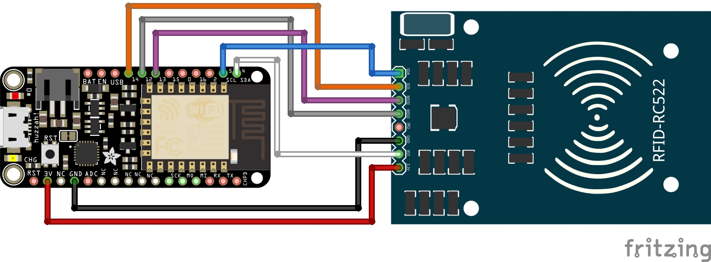
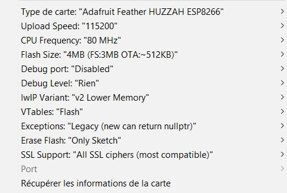

# Composants

* 	Adafruit Feather HUZZAH ESP8266
* 	Module iO lecteur RFID MFRC522 VMA405

## Documentation

*	[ESP8266](https://cdn-learn.adafruit.com/downloads/pdf/adafruit-feather-huzzah-esp8266.pdf)
*	[MFRC522](https://www.velleman.eu/downloads/29/infosheets/mfrc522_datasheet.pdf)

# Configurer le TPE

## Branchements

## Developpeur

### Installation

1. Installer avant tout le pilote pour détecter l'ESP8266 : [Pilote](http://www.silabs.com/products/development-tools/software/usb-to-uart-bridge-vcp-drivers).

2. Installer un l'IDE Arduino : [Arduino](https://www.arduino.cc/en/Main/Software).
Ouvrir le fichier **src.ino** avec l'IDE.

### Configuration

### Bibliothèques

1. Dans l'IDE aller dans **Outils > Gestionnaire de bibliothèques**

2. Rechercher et installer les bibliothèques suivantes (si elles ne sont pas détecter par l'IDE *(surligner en orange)*) :
	* 	SPI
	* 	MFRC522
	* 	ESP8266WiFi
	* 	ESP8266HTTPClient
	* 	WiFiClient

#### Carte

1. Aller ensuite dans **Fichier > Préférences**.
Dans le champs **Url de gestionnaire de cartes supplémentaires** ajoutez : [ESP8266](http://arduino.esp8266.com/stable/package_esp8266com_index.json).

2. Aller dans **Outils > Type de carte > Gestionnaire de carte**, rechercher *esp8266* et installer sa dernière version.

3. Toujours dans **Outils** placer les paramètres suivants :

*Vous devrez choisir le port lorsque vous brancherez l'ESP8266*